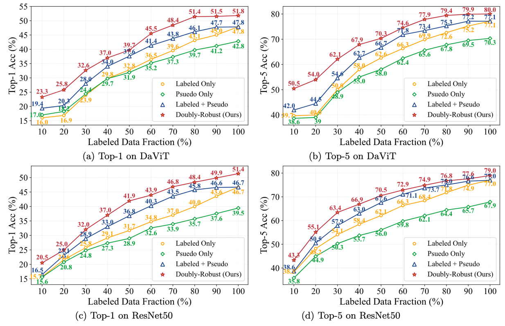

# Doubly Robust Self-Training
This repo contains the official implementation of paper "Doubly Robust Self-Training", by Banghua Zhu, Mingyu Ding, Philip Jacobson, Ming Wu, Wei Zhan, Michael Jordan, Jiantao Jiao.

### Abstract
Self-training is an important technique for solving semi-supervised learning problems.  It leverages unlabeled data by generating pseudo-labels and combining them with a limited labeled dataset for training. The effectiveness of self-training heavily relies on the accuracy of these pseudo-labels. In this paper, we introduce doubly robust self-training, a novel semi-supervised algorithm that provably balances between two extremes. When the pseudo-labels are entirely incorrect, our method reduces to a training process solely using labeled data. Conversely, when the pseudo-labels are completely accurate, our method transforms into a training process utilizing all pseudo-labeled data and labeled data, thus increasing the effective sample size. Through empirical evaluations on both the ImageNet dataset for image classification and the nuScenes autonomous driving dataset for 3D object detection, we demonstrate the superiority of the doubly robust loss over the standard self-training baseline.

### Getting Started
For the image classification task, please refer to [here](image_classification/README.md).

For the 3D object detection task, please refer to [here](3d_detection/README.md).

### Results on ImageNet100

### Citation
If you find this repo useful to your project, please consider citing it with the following bib:

    @article{zhu2023doubly,
      title={Doubly Robust Self-Training},
      author={Zhu, Banghua and Ding, Mingyu and Jacobson, Philip and Wu, Ming and Zhan, Wei, and Jordan, Michael and Jiao, Jiantao},
    }

### Acknowledgement
Our codebase is built based on [timm](https://github.com/rwightman/pytorch-image-models) and [MMDetection3D](https://github.com/open-mmlab/mmdetection3d). We thank the authors for the nicely organized code!
